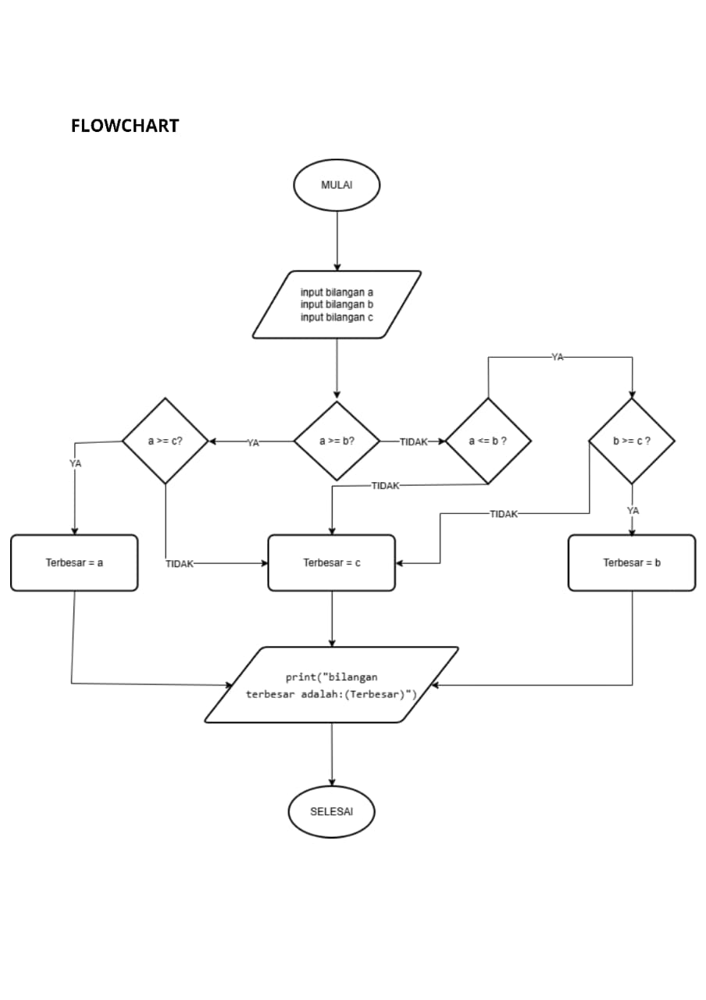
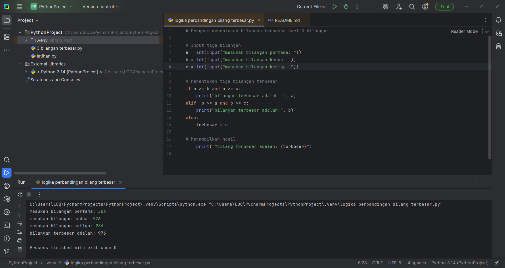

# Praktikum-3-Pengantar-Pemrograman
# Latihan-3-Muhamad-Sopian-Maulana-312510218

# flowchart

Mulai
Input
Masukkan a → bilangan pertama
Masukkan b → bilangan kedua
Masukkan c → bilangan ketiga

Proses Penentuan Bilangan Terbesar
Periksa: apakah a >= b dan a >= c?
Jika ya, maka terbesar = a
Periksa: apakah b >= a dan b >= c?
Jika ya, maka terbesar = b
Jika tidak, maka terbesar = c

Output
Tampilkan teks: "Bilangan terbesar adalah: [terbesar]"
Selesai

# hasil

